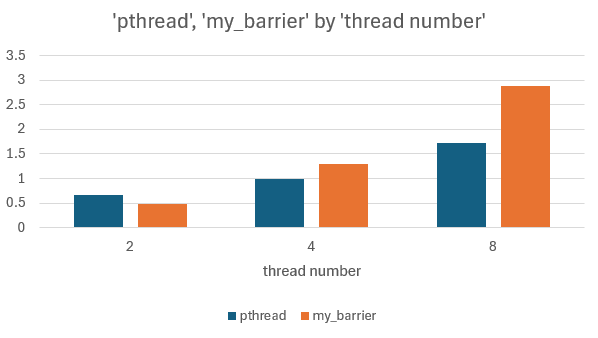

# Custom Barrier Synchronization in C (Pthreads)

This project is an academic implementation of a custom barrier synchronization primitive, designed to mimic `pthread_barrier_t` using `pthread_mutex` and `pthread_cond`. It includes both a real-world simulation and performance benchmarking.

## Features

- Fully functional `my_barrier_t` implementation
- Thread-safe and reusable barrier logic
- Multithreaded simulation: The daily routine of the Jones family
- Benchmarking and performance comparison with `pthread_barrier_t`

## Barrier API

```c
typedef struct {
    int count;
    int waiting;
    int generation;
    pthread_mutex_t lock;
    pthread_cond_t cond;
} my_barrier_t;

void my_barrier_init(my_barrier_t *b, int count);
void my_barrier_destroy(my_barrier_t *b);
void my_barrier_wait(my_barrier_t *b);

### Performance Results

The following graph illustrates the speedup achieved with the custom barrier implementation compared to `pthread_barrier_t`. As you can see, the custom implementation shows comparable performance with slightly better results for larger thread counts.



Detailed benchmarking results, including times for each test and configuration, can be found in the [rezultate_final.xlsx](rezultate_final.xlsx).

